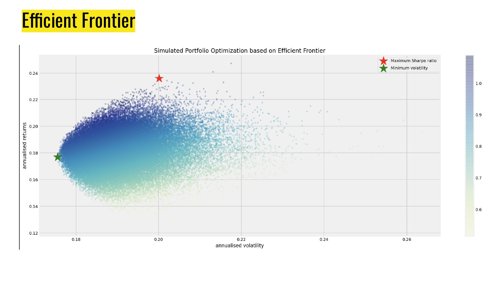

# StockX
We identify the optimal allocation of capital for a portfolio of stock returns and build a model on that historical data to predict further price movement using traditional time series techniques, machine learning algorithms and Long and Short term Neural Networks.

